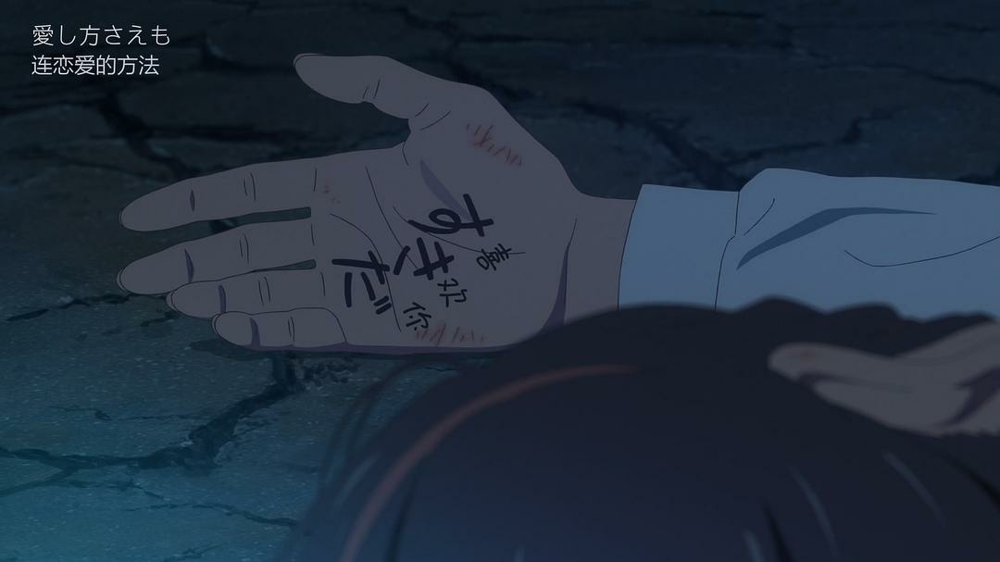
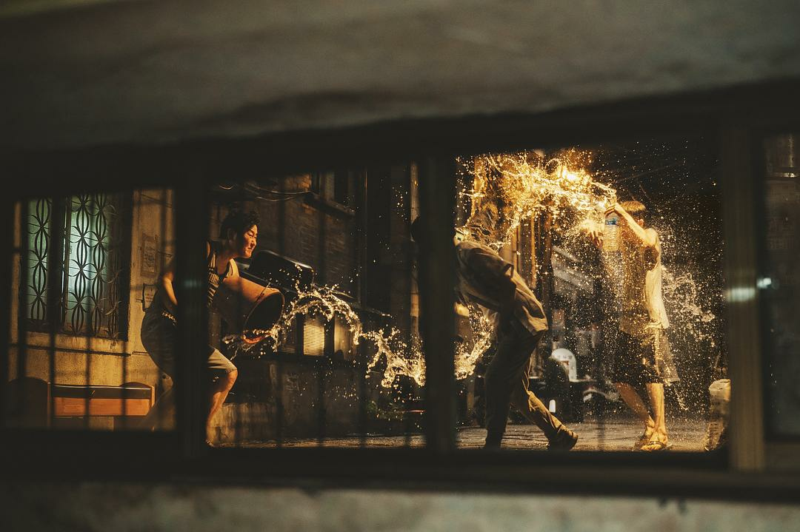
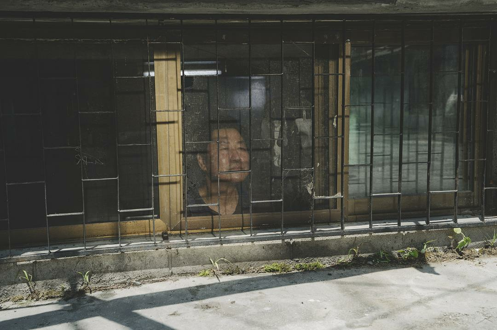
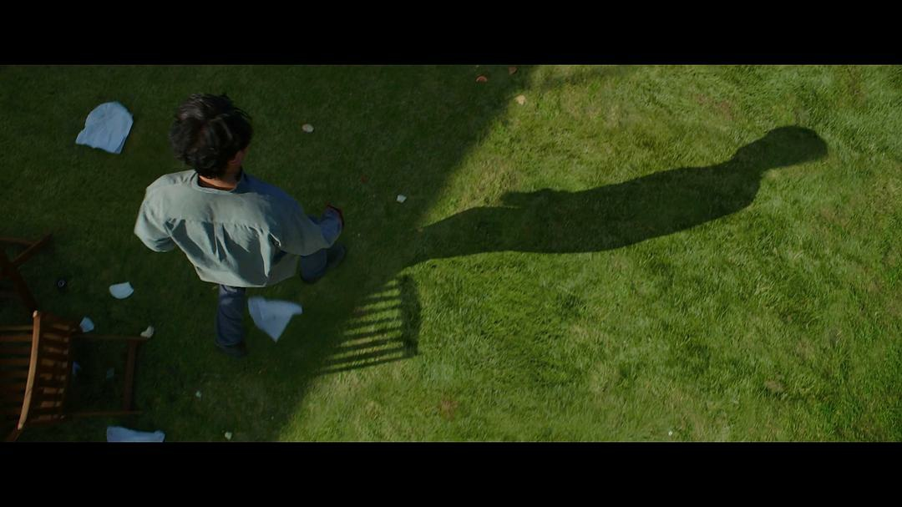
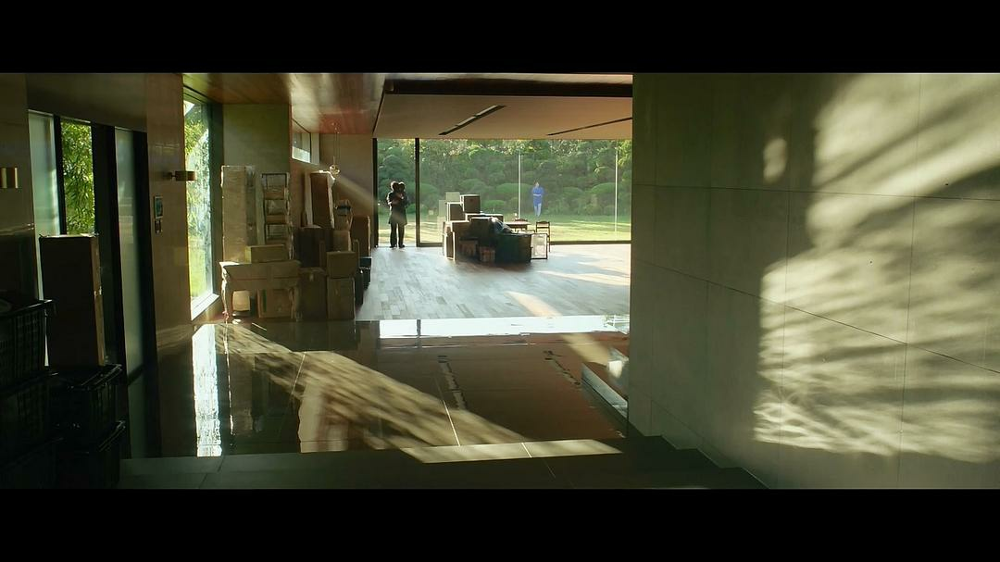

<html lang="en">
<head>
    <meta charset="UTF-8">
    <meta name="viewport" content="width=device-width, initial-scale=1.0">
    <link rel="stylesheet" href="css.css">
</head>
<body>
    <main class="main">
        <section class="list-item">
            

                
            

            

                
「王」

                
爱是一种需要不断被人证明的虚妄，就像烟花需要被点燃才能看到辉煌一样。

            

        </section>
        <section class="list-item">
            

                
            

            

                
「胜」

                
一个人想事好想找个人来陪，一个人失去了自己，不知还有没有要在追的可望。

            

        </section>
        <section class="list-item">
            

                
            

            

                
「的」

                
爱，就大声说出来，因为你永远都不会知道，明天和意外哪个会先来。

            

        </section>
        <section class="list-item">
            

                
            

            

                
「博」

                
如果等待可以换来奇迹的话，我宁愿等下去，哪怕一年，抑或一生！

            

        </section>
        <section class="list-item">
            

                
            

            

                
「客」

                
岁月静好，念起便是温暖。生活中的我，似乎早已经褪去了当年的沉静与温柔。

            

        </section>
        <section class="list-item">
            

                
            

            

                
「呀」

                
如果不能一起去极乐世界，那就让我停留在，她曾经呼吸过的世界吧。

            

        </section>
    </main>
</body>
</html>
